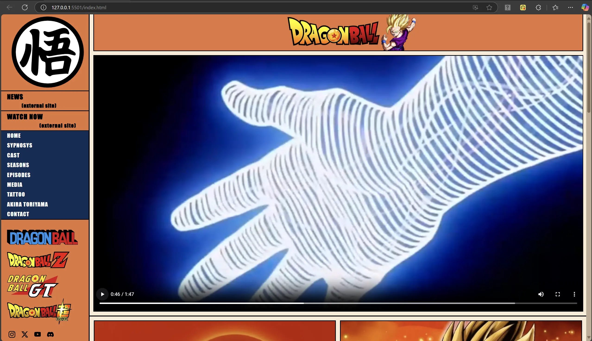
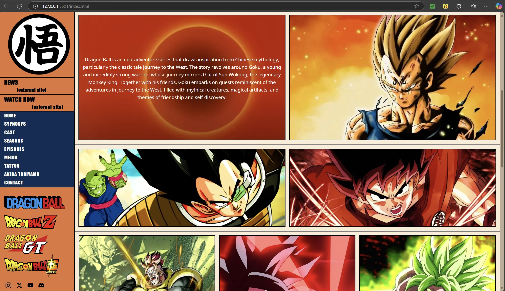
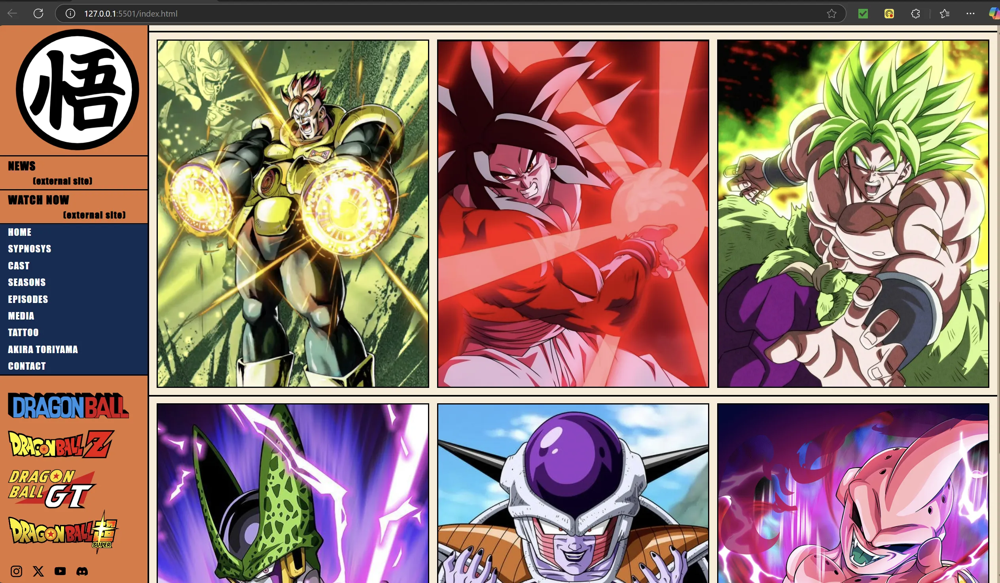
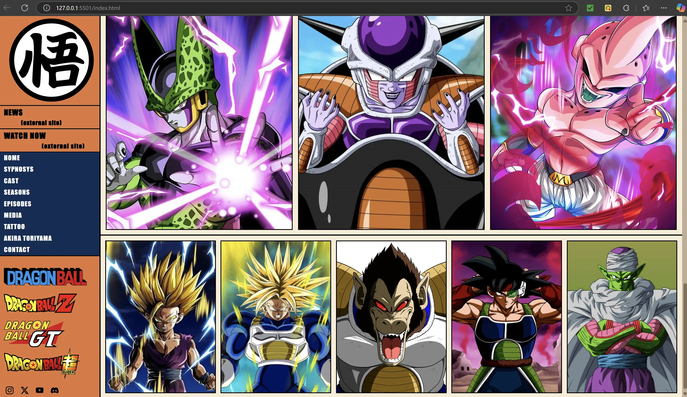
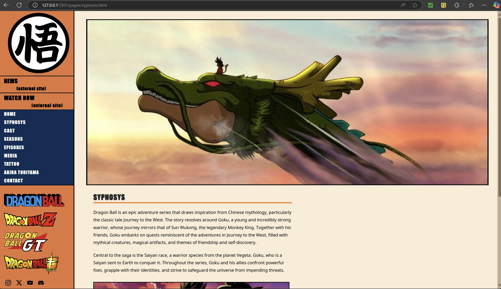
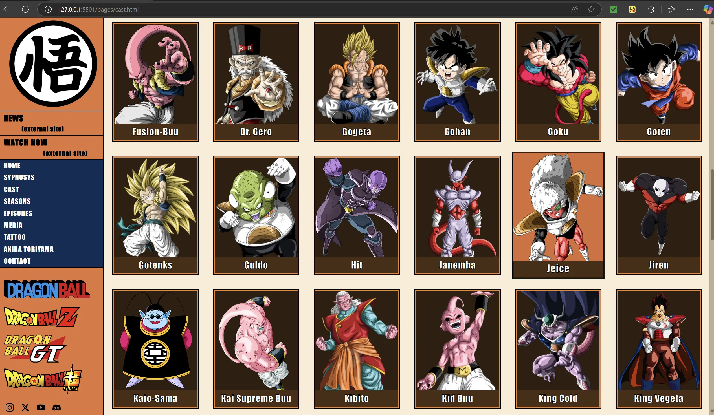
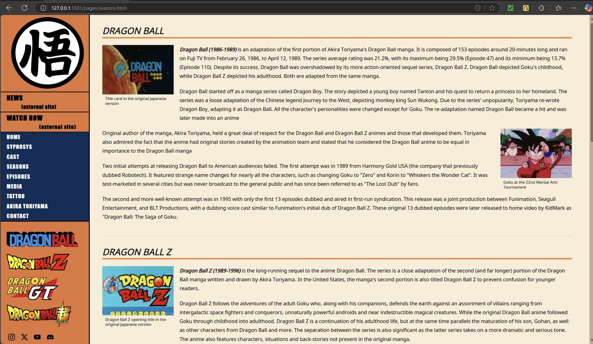
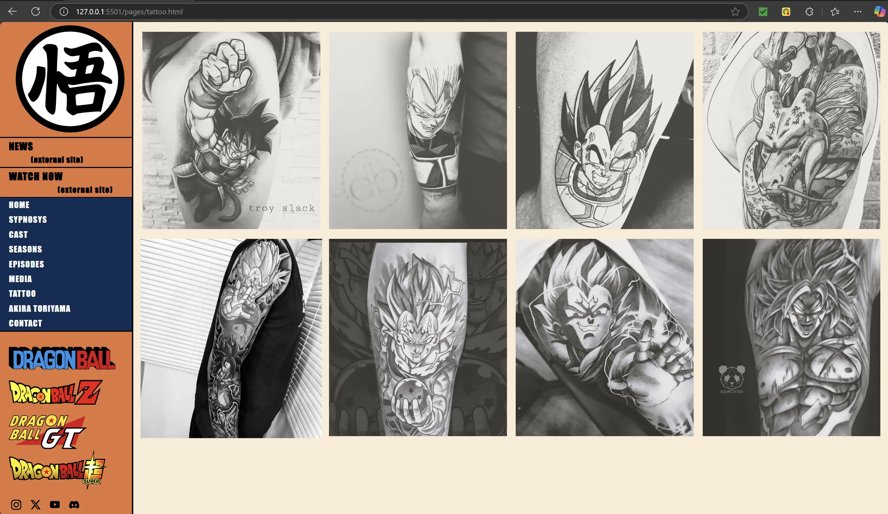
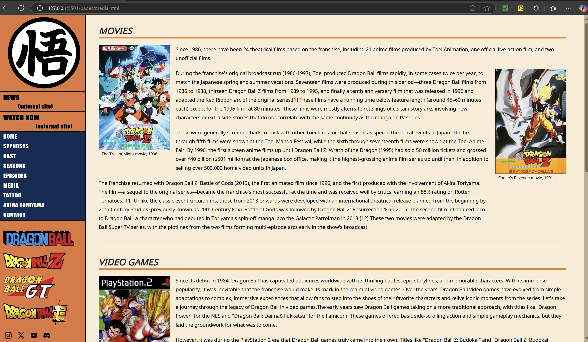
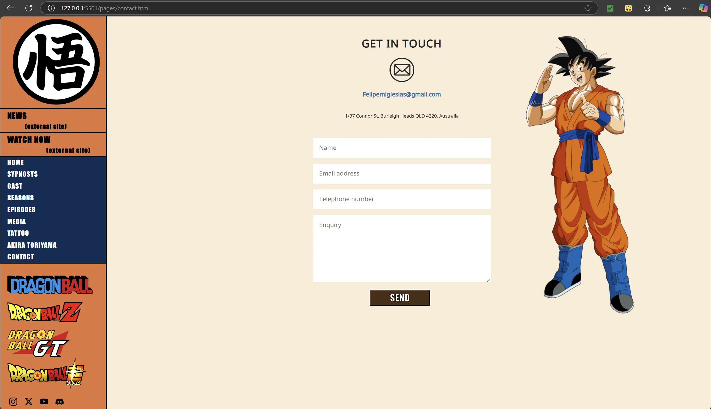

Just double click on the index file to open the website** in your default browser and enjoy one of the most epic stories of all time!
In honor of Akira Toriyama.

This is a Frontend project in which I built a Dragon Ball themed website** using HTML and CSS.

* No frameworks
* No AI
* Local content
* Proper folder structure

** The website is optimized for a 27" 3840 x 2160 display with a 16:9 aspect ratio.

## 📷 Screenshots

### index.html

### sypnosis.html

### cast.html

### seasons.html

### tattoo.html

### media.html

### contact.html

